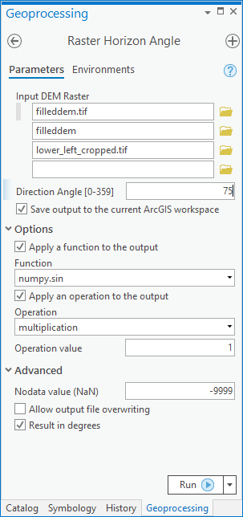
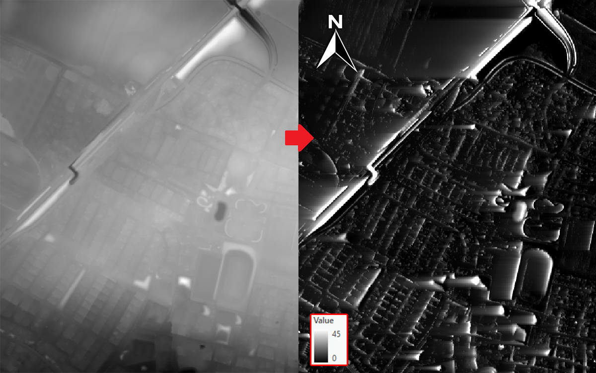

# Horizon Angle Project for NGEN13 course (Lund's University Geomatics Master's Programme) October 2020

* I developed a script that calculates the maximum angular obstruction for each cell on a raster, specially from a digital elevation model, recreating functions from within GRASS GIS and GDAL. The project required the design of a graphic interface (GUI) for ArcPro (ArcGIS Pro), allowing the user to easily parse parameters between ArcGIS and Python, for one or more rasters, selecting the desired Direction Angle, applying functions and operations to the results if desired and some extra options.

